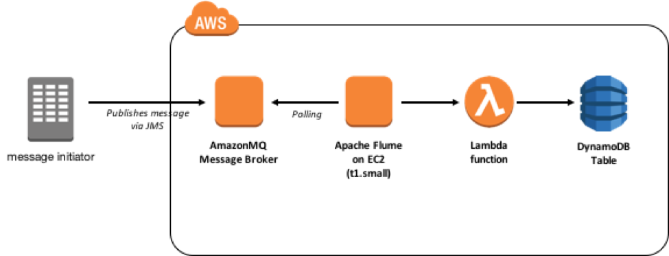

# AWS Venturi : Lambda Integration

This project is an example of one approach to invoking AWS Lambda from Queues and Topics managed by AmazonMQ brokers. This and other similar patterns can be useful in integrating legacy systems that leverage common APIs such as JMS with serverless architectures.

Our solution makes use of an instance of [Apache Flume](https://flume.apache.org/), running on an EC2 instance in your AWS account. Flume is a distributed service for collecting log data using streaming data flows that provides a flexible plugin architecture that we leverage here to subscribe to messages from AmazonMQ and then pass them on to Lambda.



## Getting Started

To get started, clone this repository. The repository contains a [CloudFormation](https://aws.amazon.com/cloudformation/) template and source code to deploy and run the sample.

### Prerequisites

To run the sample, you will need to:

1. Select an AWS Region into which you will deploy services. Be sure that all required services (AmazonMQ, AWS Lambda, Amazon DynamoDB, etc.) are available in the Region you select.
2. Confirm your [installation of the latest AWS CLI](http://docs.aws.amazon.com/cli/latest/userguide/installing.html) (at least version 1.11.21).
3. Confirm the [AWS CLI is properly configured](http://docs.aws.amazon.com/cli/latest/userguide/cli-chap-getting-started.html#cli-quick-configuration) with credentials that have administrator access to your AWS account.
4. [Install Node.js and NPM](https://docs.npmjs.com/getting-started/installing-node).

## Deployment

We will deploy the solution in two parts, first a new AmazonMQ broker, then an EC2 instance configured with Apache Flume, a sample Lambda function, and other supporting resources.

### Part 1: AmazonMQ Broker

TBD

### Part 2: Serverless

We will use the [AWS Serverless Application Model](https://github.com/awslabs/serverless-application-model) to manage deployment of our EC2 instance, Lambda function, and other AWS resources:

1. Create a [new keypair using the AWS EC2 Console](http://docs.aws.amazon.com/AWSEC2/latest/UserGuide/ec2-key-pairs.html#having-ec2-create-your-key-pair), e.g. "flume". While not strictly required, we recommend creating a keypair so that you can troubleshoot and/or view the configuration of the Flume instance.

2. From the command line, create a new S3 Bucket from which to deploy our source code:

	```
	$ aws s3 mb s3://<MY_BUCKET_NAME>
	```

3. Install Lambda dependencies:

	```
	$ cd flume && npm install

	$ cd ..
	```

4. Using the Serverless Application Model, package the source code:

	```
	$ aws cloudformation package --template-file template.yaml \
                --s3-bucket <MY_BUCKET_NAME> \
                --output-template-file packaged.yaml
	```

5. We will launch the Flume instance your account's default VPC. You can retrieve the ID for the VPC in the Amazon MQ Console or with the AWS CLI as follows (e.g. "vpc-abcd1234"):

	```
	$ aws ec2 describe-vpcs --filters Name=isDefault,Values=true \
                            --query Vpcs[0].VpcId
	```

6. Amazon MQ currently launches new brokers in the default Security Group for your VPC. Using the Amazon MQ console or AWS CLI, you can retrieve the default Security Group ID (e.g. "sg-abcd1234"). Note that you will need to include the default VPC ID captured in the previous step:

	```
	$ aws ec2 describe-security-groups --group-names default \
							--filters Name=vpc-id,Values=<DEFAULT_VPC_ID> \
							--query SecurityGroups[0].GroupId
	```

7. Finally, deploy the function and other resources:

	```
	$ aws cloudformation deploy --template-file packaged.yaml \
	            --stack-name aws-amazonmq-sample \
	            --capabilities CAPABILITY_IAM \
	            --parameter-overrides AmazonMQHost=ssl://<BROKER_ENDPOINT>:61614 \
                                      AmazonMQLogin=<AMAZONMQ_USERNAME> \
                                      AmazonMQPassword=<AMAZONMQ_PASSWORD> \
                                      DefaultVpcId=<DEFAULT_VPC_ID> \
                                      DefaultSecurityGroupId=<DEFAULT_SECURITY_GROUP_ID> \
                                      KeyName=<KEYPAIR_NAME> \
                                      SSHLocation=<YOUR_IP_ADDRESS>
	```

8. It will take a few minutes for CloudFormation to finish deploying. Once status is `CREATE_COMPLETE`, move on to testing the integration.


## Run!

Once the CloudFormation stack is complete, we can send a test message using the ActiveMQ console.


1. Open the ActiveMQ Management Console, available at https://<BROKER_ENDPOINT>:8162.

2. Click the link "Manage ActiveMQ broker" and enter the username and password from when you created the broker.

3. In the menu just beneath the ActiveMQ logo, click the link at the far right, "Send".

4. Modify two fields:

	* Destination: SAMPLE_QUEUE
	* Message body: Hello World, let's invoke Lambda!

5. Click the Send button. Explore other aspects of the ActiveMQ console, particularly the Subscribers section, you should see one subscriber, your Flume instance.

6. When ready, open the AWS Console and navigate to DynamoDB.

7. Select "Tables" in the menu at left and then pick the table named "amazonmq-sample".

8. Select the "Items" tab and view items below. You should see an entry that contains the message from above. If not, you may consider using SSH to review configuration on the Flume EC2 instance.


## Cleaning Up

Finally, we can clean up the environment using CloudFormation:

```
$ aws cloudformation delete-stack --stack-name aws-amazonmq-sample
```

As your AmazonMQ broker is not managed by CloudFormation, you will need to delete via the Console if desired.

## Other Sample Functions

In addition to the function exercised here, we have included several other Lambda functions that will interface with AmazonMQ in various ways as well as a sample that can draw messages from Amazon Kinesis. To deploy these functions, simply uncomment applicable sections of the `template.yaml` file.

## Troubleshooting

If you have trouble connecting to the ActiveMQ Management Console for your Amazon MQ broker or the Flume instance is unable to connect, be sure to check the Security Group associated with the broker (available from the Amazon MQ console). As part of our CloudFormation template, we add rules to allow appropriate access, but this is generally a good initial troubleshooting step.

If the Security Group is setup properly and messages still do not appear in DynamoDB, we suggest accessing the Flume EC2 instance. Check if Flume is running and consider restarting it.

## Authors

* **jkahn** - *initial work*
